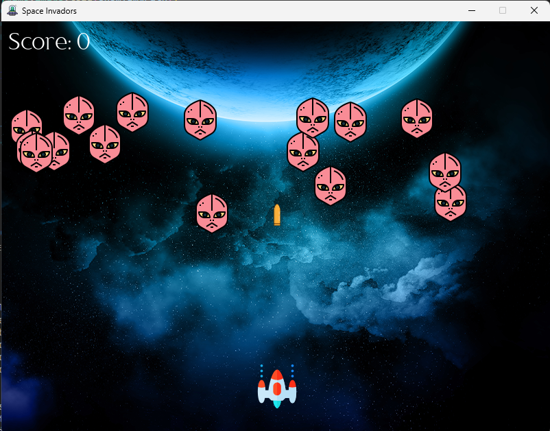
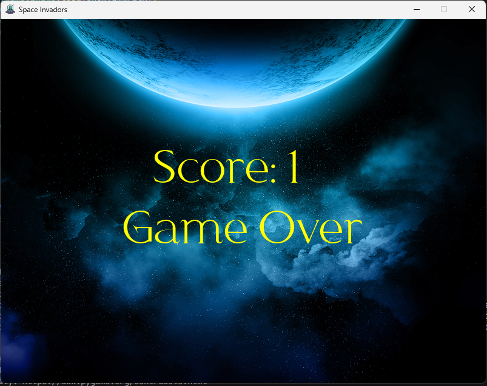

# Space Invaders

A classic Space Invaders game built with Pygame. Control a spaceship to shoot down waves of enemy ships, avoid collisions, and achieve a high score in this retro-style arcade game.

## Screenshots
<div style="display: flex; justify-content: space-around;">
    
    
</div>

## Clone the Repository
To clone the repository and run the game from source:
1. Open a terminal and run:
   ```bash
   git clone https://github.com/amithaisuru/freecodecamp-pygame-spaceInvador
   cd freecodecamp-pygame
   ```
2. Install dependencies:
   ```bash
   pip install pygame
   ```
3. Run the game:
   ```bash
   python main.py
   ```

## Download and Run the Executable
To download and run the pre-built executable:
1. Download the zip file from [this link](https://github.com/amithaisuru/freecodecamp-pygame-spaceInvador/blob/main/space%20inavdors.zip).
2. Extract the zip file to a folder on your computer.
3. Go to `space invadors` folder
4. Double-click `game.exe` to run the game.

## How to Play
Move : Left and Right Arrow keys
Shoot : Spacebar
